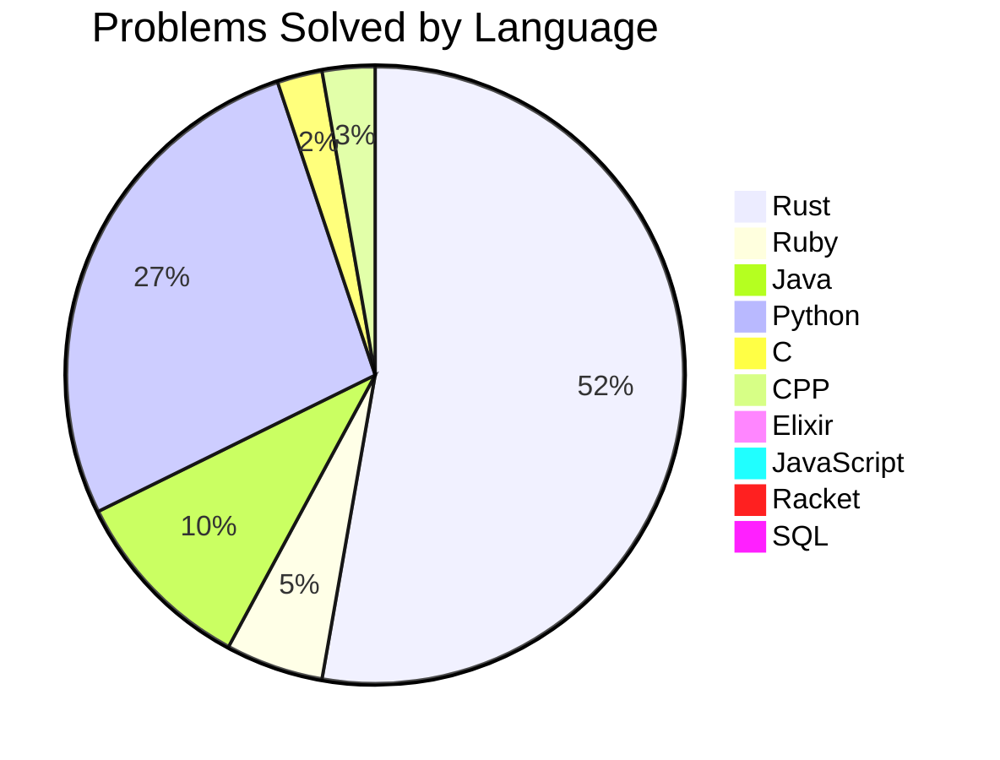

# Liam's LeetCode solutions
## Table of Contents
+ [About](#about)
+ [Usage](#usage)
+ [Personal Milestones](#personal_milestones)
## About
I created this repository when I decided to start practicing leetcode in my freetime as a senior in highschool (cerca January 2022), knowing only java at the time (I learned the language on my own, and got better at it through AP Computer Science) the bulk of the solutions are likely in java, as of right now (June 2022) I'm still most comfortable with java, but plan to extend into other languages such as C and Rust.

I guess a bit of a cool goal for this project is to have more than a thousand leetcode solutions documented in this repo in a multitude of different languages, but I don't know if that's gonna happen anytime soon

## Usage

Honestly, this repo primarily exists for personal use, and logging my improvement as a programmer/computer scientist over time, Use my solutions at your own risk, as there are likely better ones out there! :)

## Personal Milestones
| Date        | Achievement     | Link
| :-------------: |:------------------|:-:|
| **June 4th 2022** | Today, I successfully coded an entire solution all by myself without giving up and seeing how someone else did it, I achieved this on Leetcode Problem 169, the code that I initially submitted without any outside support can be seen in the Alternate-Solution subclass of the file!| [Leetcode Problem 169 (Java Solution)](editor/en/Java/169.majority-element.java)  
|**June 4th 2022**| First Rust solution! | [Leetcode 2235 Add Two Integers](editor/en/rust/2235.add-two-integers.rs)
|**June 6th 2022**| First Ruby Solution | [Leetcode 2235 Add Two Integers](editor/en/Ruby/2235.add-two-integers.rb)
|**January 11th 2023| First independant Rust solution AND explanation! | [Leetcode 12 Integer to Roman](editor/en/rust/src/12_roman-to-integer.rs)|
|**February 12 2024| First tried a medium problem, and it ran on first try, as well as had the answer accepted| [leetcode 2149 Rearrange Array elements by sign](/rust/src/rearrange_array_elements_by_sign_2149.rs)|
|**January 8th 2024**| Fastest time to solve a problem, 46 seconds | [Leetcode 2255 Count prefixes of a given string](count_prefixes_of_a_given_string_2255.rs) |

## List of problems solved
# Chart:

### Problems Marked "Revisit": 18
| Problem Number | Problem Name | Language | Estimated Solved Date| WriteSolution? |
|--------------|----------------|---------|-----------------------|----------------|
| 1 | Two Sum | [Java](./Java/1.two-sum.java), [Rust](./rust/src/two_sum_1.rs),  | April 04, 2022 | No |
| 2 | Add Two Numbers | [C](./C/2.add-two-numbers.c), [Java](./Java/2.add-two-numbers.java), [Rust](./rust/src/add_two_numbers_2.rs),  | December 19, 2024 | No |
| 3 | Longest Substring Without Repeating Characters | [Python](./python/longest_substring_without_repeating_characters_3.py),  | January 26, 2025 | No |
| 4 | Median Of Two Sorted Arrays | [Java](./Java/4.median-of-two-sorted-arrays.java),  | June 09, 2022 | No |
| 9 | Palindrome Number | [Java](./Java/9.palindrome-number.java), [Ruby](./Ruby/9.palindrome-number.rb), [Rust](./rust/src/palindrome_number_9.rs),  | June 13, 2022 | No |
| 12 | Integer To Roman | [Rust](./rust/src/integer_to_roman_12.rs),  | January 11, 2023 | [Yes](assewriteu/12.md)|
| 13 | Roman To Integer | [Ruby](./Ruby/13.roman-to-integer.rb), [Rust](./rust/src/roman_to_integer_13.rs),  | June 13, 2022 | No |
| 14 | Longest Common Prefix | [Ruby](./Ruby/14.longest-common-prefix.rb),  | June 26, 2022 | No |
| 17 | Letter Combinations Of A Phone Number | [Java](./Java/17.letter-combinations-of-a-phone-number.java),  | June 19, 2022 | No |
| 20 | Valid Parentheses | [Java](./Java/20.valid-parentheses.java),  | June 15, 2022 | No |
| 26 | Remove Duplicates From Sorted Array | [Java](./Java/26.remove-duplicates-from-sorted-array.java), [Rust](./rust/src/remove-duplicates-from-sorted-array_26.rs),  | November 11, 2022 | No |
| 27 | Remove Element | [Rust](./rust/src/remove_element_27.rs),  | December 25, 2024 | No |
| 28 | Find Index Of First Occurence In String | [Rust](./rust/src/find_index_of_first_occurence_in_string_28.rs),  | April 04, 2024 | No |
| 36 | Valid Sudoku | [Python](./python/valid_sudoku_36.py), [Rust](./rust/src/valid_sudoku_36.rs),  | December 23, 2024 | No |
| 41 | First Missing Positive | [Rust](./rust/src/first_missing_positive_41.rs),  | March 25, 2024 | No |
| 46 | Permutations | [Java](./Java/46.permutations.java),  | June 11, 2022 | No |
| 48 | Rotate Image | [Java](./Java/48.rotate-image.java), [Ruby](./Ruby/48.rotate-image.rb),  | December 10, 2022 | No |
| 49 | Group Anagrams | [Python](./python/group_anagrams_49.py), [Rust](./rust/src/group_anagrams_49.rs),  | February 06, 2024 | No |
| 57 | Insert Interval | [Rust](./rust/src/insert_interval_57.rs),  | January 15, 2023 | No |
| 58 | Length Of Last Word | [Rust](./rust/src/length_of_last_word_58.rs),  | March 31, 2024 | No |
| 67 | Add Binary | [Rust](./rust/src/add_binary_67.rs),  | January 29, 2024 | No |
| 69 | Sqrt X | [Ruby](./Ruby/69.sqrt-x.rb),  | June 14, 2022 | No |
| 75 | Sort Code | [Rust](./rust/src/sort_code_75.rs),  | June 12, 2024 | No |
| 78 | Subsets | [Rust](./rust/src/subsets_78.rs),  | May 22, 2024 | No |
| 79 | Word Search | [Rust](./rust/src/word_search_79.rs),  | April 03, 2024 | No |
| 85 | Maximal Rectangle | [Rust](./rust/src/maximal_rectangle_85.rs),  | April 13, 2024 | No |
| 88 | Merge Sorted Array | [Python](./python/merge_sorted_array_88.py), [Rust](./rust/src/merge_sorted_array_88.rs),  | December 27, 2024 | No |
| 125 | Valid Palindrome | [Rust](./rust/src/valid_palindrome_125.rs),  | March 06, 2024 | No |
| 128 | Longest Consecutive Sequence | [Java](./Java/128.longest-consecutive-sequence.java), [Python](./python/longest_consecutive_sequence_128.py),  | December 23, 2024 | No |
| 129 | Sum Root To Leaf Numbers | [Rust](./rust/src/sum_root_to_leaf_numbers_129.rs),  | April 14, 2024 | No |
| 136 | Single Number | [Rust](./rust/src/single_number_136.rs),  | February 10, 2024 | No |
| 141 | Linked List Cycle | [Python](./python/linked_list_cycle_141.py),  | March 06, 2024 | No |
| 150 | Evaluate Reverse Polish Notation | [Rust](./rust/src/evaluate_reverse_polish_notation_150.rs),  | January 29, 2024 | No |
| 165 | Compare Version Numbers | [Rust](./rust/src/compare_version_numbers_165.rs),  | May 03, 2024 | No |
| 169 | Majority Element | [Java](./Java/169.majority-element.java), [Rust](./rust/src/majority_element_169.rs),  | June 04, 2022 | No |
| 198 | House Robber | [Rust](./rust/src/house_robber_198.rs),  | January 23, 2024 | No |
| 205 | Isomorphic Strings | [Rust](./rust/src/isomorphic_strings_205.rs),  | April 01, 2024 | No |
| 207 | Course Schedule | [Python](./python/course_schedule_207.py), [Rust](./rust/src/course_schedule_207.rs),  | January 24, 2025 | No |
| 210 | Course Schedule Ii | [Rust](./rust/src/course_schedule_ii_210.rs),  | January 24, 2025 | No |
| 217 | Contains Duplicate | [Rust](./rust/src/contains_duplicate_217.rs),  | February 10, 2024 | No |
| 231 | Power Of Two | [Python](./python/power_of_two_231.py),  | February 18, 2024 | [Yes](assewriteu/231.md)|
| 232 | Implement Queue Using Stacks | [Rust](./rust/src/implement_queue_using_stacks_232.rs),  | January 29, 2024 | No |
| 237 | Delete Node In Linked List | [C](./C/237.delete-node-in-linked-list.c), [Python](./python/delete_node_in_linked_list_237.py),  | May 05, 2024 | No |
| 238 | Product Of Array Except Self | [CPP](./C/238.product-of-array-except-self.cpp),  | March 14, 2024 | No |
| 242 | Valid Anagram | [Rust](./rust/src/valid_anagram_242.rs),  | February 10, 2024 | No |
| 258 | Add Digits | [Python](./python/add_digits_258.py), [Elixir](./elixir/add_digits_258.ex),  | December 25, 2024 | No |
| 268 | Missing Number | [Rust](./rust/src/missing_number_268.rs),  | February 19, 2024 | No |
| 271 | Encode And Decode Strings | [Python](./python/encode_and_decode_strings_271.py),  | May 09, 2024 | No |
| 283 | Move Zeroes | [Rust](./rust/src/move_zeroes_283.rs),  | December 25, 2024 | No |
| 287 | Find The Duplicate Number | [Rust](./rust/src/find_the_duplicate_number_287.rs),  | March 23, 2024 | No |
| 290 | Word Pattern | [Rust](./rust/src/word_pattern_290.rs),  | June 28, 2022 | No |
| 310 | Minimum Height Trees | [CPP](./C/310.minimum-height-trees.cpp),  | April 23, 2024 | No |
| 344 | Reverse String | [Rust](./rust/src/reverse_string_344.rs),  | June 01, 2024 | No |
| 347 | Top K Frequent Elements | [Rust](./rust/src/top_k_frequent_elements_347.rs),  | March 19, 2024 | No |
| 349 | Intersection Of Two Arrays | [Rust](./rust/src/intersection_of_two_arrays_349.rs),  | March 09, 2024 | No |
| 367 | Valid Perfect Square | [Ruby](./Ruby/367.valid-perfect-square.rb),  | June 14, 2022 | No |
| 371 | Sum Of Two Integers | [C](./C/371.sum-of-two-integers.c),  | December 19, 2024 | No |
| 380 | Insert Delete Get Random | [Rust](./rust/src/insert_delete_get_random_380.rs),  | January 17, 2024 | No |
| 387 | First Unique Character In A String | [Rust](./rust/src/first_unique_character_in_a_string_387.rs), [Python](./python/first_unique_character_in_a_string_387.py),  | February 04, 2024 | No |
| 389 | Find The Difference | [Rust](./rust/src/find_the_difference_389.rs),  | April 04, 2024 | No |
| 404 | Sum Of Left Leaves | [Rust](./rust/src/sum_of_left_leaves_404.rs),  | April 13, 2024 | No |
| 442 | Find All Duplicates In Array | [Rust](./rust/src/find_all_duplicates_in_array_442.rs),  | March 24, 2024 | No |
| 451 | Sort Characters By Frequency | [Rust](./rust/src/sort_characters_by_frequency_451.rs),  | February 07, 2024 | No |
| 494 | Target Sum | [Python](./python/target_sum_494.py),  | December 26, 2024 | No |
| 506 | Relative Ranks | [Rust](./rust/src/relative_ranks_506.rs),  | May 07, 2024 | No |
| 513 | Find Bottom Left Tree Value | [Rust](./rust/src/find_bottom_left_tree_value_513.rs),  | February 28, 2024 | No |
| 514 | Freedom Trail | [Python](./python/freedom_trail_514.py),  | April 28, 2024 | No |
| 515 | Find Largest Value In Each Tree Row | [Python](./python/find_largest_value_in_each_tree_row_515.py), [Rust](./rust/src/find_largest_value_in_each_tree_row_515.rs),  | December 25, 2024 | No |
| 623 | Add One Row To Tree | [Rust](./rust/src/add_one_row_to_tree_623.rs),  | April 16, 2024 | No |
| 645 | Set Mismatch | [Rust](./rust/src/set_mismatch_645.rs),  | January 21, 2024 | No |
| 647 | Palindromic Strings | [Rust](./rust/src/palindromic_strings_647.rs),  | February 10, 2024 | No |
| 678 | Valid Parenthesis String | [Rust](./rust/src/valid_parenthesis_string_678.rs),  | April 07, 2024 | No |
| 680 | Valid Palindrome Ii | [Java](./Java/680.valid-palindrome-II.java),  | April 04, 2022 | No |
| 709 | To Lower Case | [Python](./python/to_lower_case_709.py), [Rust](./rust/src/to_lower_case_709.rs),  | January 08, 2025 | No |
| 722 | Remove Comments | [Java](./Java/722.remove-comments.java),  | June 05, 2022 | No |
| 724 | Find Pivot Index | [Rust](./rust/src/find_pivot_index_724.rs),  | January 12, 2023 | No |
| 752 | Open The Lock | [Rust](./rust/src/open_the_lock_752.rs),  | April 22, 2024 | No |
| 786 | Kth Smallest Prime Fraction | [Rust](./rust/src/kth_smallest_prime_fraction_786.rs),  | May 09, 2024 | No |
| 791 | Custom Sort String | [Rust](./rust/src/custom_sort_string_791.rs),  | March 11, 2024 | No |
| 827 | Making A Large Island | [Python](./python/making_a_large_island_827.py),  | January 31, 2025 | No |
| 861 | Score After Flipping Matrix | [Rust](./rust/src/score_after_flipping_matrix_861.rs),  | May 12, 2024 | No |
| 868 | Binary Gap | [Java](./Java/868.binary-gap.java),  | April 04, 2022 | No |
| 881 | Boats To Save People | [Rust](./rust/src/boats_to_save_people_881.rs),  | May 04, 2024 | No |
| 914 | X Of A Kind In A Deck Of Cards | [Java](./Java/914.x-of-a-kind-in-a-deck-of-cards.java), [Rust](./rust/src/x_of_a_kind_in_a_deck_of_cards_914.rs),  | June 21, 2022 | No |
| 916 | Word Subsets | [Rust](./rust/src/word_subsets_916.rs), [Python](./python/word_subsets_916.py),  | January 09, 2025 | [Yes](assewriteu/916.md)|
| 926 | Flip String To Monotone Increasing | [Rust](./rust/src/flip_string_to_monotone_increasing_926.rs),  | January 17, 2023 | No |
| 938 | Range Sum Of Bst | [Rust](./rust/src/range_sum_of_bst_938.rs),  | January 08, 2024 | No |
| 945 | Minimum Increment To Make Array Unique | [Rust](./rust/src/minimum_increment_to_make_array_unique_945.rs),  | June 14, 2024 | No |
| 961 | N Repeated Element In Size 2 N Array | [Java](./Java/961.n-repeated-element-in-size-2-n-array.java),  | June 04, 2022 | No |
| 963 | Minimum Area Rectangle Ii | [Java](./Java/963.minimum-area-rectangle-II.java),  | January 16, 2023 | No |
| 974 | Subarray Sums Divisible By K | [Rust](./rust/src/subarray_sums_divisible_by_k_974.rs),  | January 18, 2023 | No |
| 981 | Time Based Key Value Store | [Java](./Java/981.time-based-key-value-store.java),  | June 05, 2022 | No |
| 983 | Minimum Cost For Tickets | [Python](./python/minimum_cost_for_tickets_983.py),  | January 03, 2025 | No |
| 1026 | Maximum Difference Between Node And Ancestor | [Java](./Java/1026.maximum-difference-between-node-and-ancestor.java),  | December 09, 2022 | No |
| 1108 | Defanging An Ip Address | [Python](./python/defanging_an_ip_address_1108.py),  | December 25, 2024 | No |
| 1137 | Nth Tribonacci Number | [C](./C/1137.nth-tribonacci-number.c), [Rust](./rust/src/nth_tribonacci_number_1137.rs),  | January 30, 2023 | No |
| 1143 | Longest Common Subsequence | [Rust](./rust/src/longest_common_subsequence_1143.rs),  | January 25, 2024 | No |
| 1190 | Reverse Substrings Between Each Pair Of Parenthesis | [Python](./python/reverse_substrings_between_each_pair_of_parenthesis_1190.py),  | July 11, 2024 | No |
| 1219 | Path With Maximum Gold | [Rust](./rust/src/path_with_maximum_gold_1219.rs),  | May 13, 2024 | No |
| 1291 | Sequential Digits | [Rust](./rust/src/sequential_digits_1291.rs),  | February 01, 2024 | No |
| 1346 | Check If N And Its Double Exist | [Python](./python/check_if_n_and_its_double_exist_1346.py), [Rust](./rust/src/check_if_n_and_its_double_exist_1346.rs),  | December 01, 2024 | No |
| 1363 | Largest Multiple Of Three | [Java](./Java/1363.largest-multiple-of-three.java),  | June 12, 2022 | No |
| 1408 | String Matching In An Array | [Python](./python/string_matching_in_an_array_1408.py),  | January 06, 2025 | No |
| 1422 | Maximum Score After Splitting A String | [Python](./python/maximum_score_after_splitting_a_string_1422.py),  | January 03, 2025 | No |
| 1455 | Check If A Word Occurs As A Prefix Of Any Word In A Sentence | [Python](./python/check_if_a_word_occurs_as_a_prefix_of_any_word_in_a_sentence_1455.py), [Rust](./rust/src/check_if_a_word_occurs_as_a_prefix_of_any_word_in_a_sentence_1455.rs),  | December 01, 2024 | No |
| 1470 | Shuffle The Array | [Ruby](./Ruby/1470.shuffle-the-array.rb),  | June 28, 2022 | [Yes](assewriteu/1470.md)|
| 1480 | Running Sum Of 1 D Array | [Java](./Java/1480.running-sum-of-1-d-array.java), [Ruby](./Ruby/1480.running-sum-of-1-d-array.rb), [Rust](./rust/src/running_sum_of_1_d_array_1480.rs),  | June 07, 2022 | [Yes](assewriteu/1480.md)|
| 1481 | Least Number Of Unique Integers After K Removals | [Rust](./rust/src/least_number_of_unique_integers_after_k_removals_1481.rs),  | February 15, 2024 | No |
| 1486 | Xor Operation In An Array | [Rust](./rust/src/XOR_operation_in_an_array_1486.rs), [Python](./python/xor_operation_in_an_array_1486.py),  | January 08, 2025 | No |
| 1509 | Minimum Difference Between Largest And Smallest Value In Three Moves | [Rust](./rust/src/minimum_difference_between_largest_and_smallest_value_in_three_moves_1509.rs),  | July 02, 2024 | No |
| 1512 | Number Of Good Pairs | [Python](./number_of_good_pairs_1512.py),  | January 07, 2025 | No |
| 1518 | Water Bottles | [Python](./python/water_bottles_1518.py), [Rust](./rust/src/water_bottles_1518.rs),  | July 06, 2024 | No |
| 1519 | Nodes In Subtree With Same Label | [Rust](./rust/src/nodes_in_subtree_with_same_label_1519.rs),  | January 12, 2023 | No |
| 1534 | Count Good Triplets | [Rust](./rust/src/count_good_triplets_1534.rs),  | December 25, 2024 | No |
| 1544 | Make The String Great | [Rust](./rust/src/make_the_string_great_1544.rs),  | April 04, 2024 | No |
| 1603 | Design Parking System | [Rust](./rust/src/design_parking_system_1603.rs),  | January 08, 2024 | No |
| 1608 | Special Array With X Elements Greather Than Or Equal X | [Python](./python/special_array_with_x_elements_greather_than_or_equal_x_1608.py),  | May 27, 2024 | No |
| 1609 | Even Odd Tree | [Python](./python/even_odd_tree_1609.py), [Rust](./rust/src/even_odd_tree_1609.rs),  | February 28, 2024 | No |
| 1614 | Maximum Nesting Depth Of Parenthesis | [Rust](./rust/src/maximum_nesting_depth_of_parenthesis_1614.rs),  | April 03, 2024 | No |
| 1672 | Richest Customer Wealth | [Rust](./rust/src/richest_customer_wealth_1672.rs),  | June 04, 2022 | No |
| 1700 | Number Of Students Unable To Eat Lunch | [Rust](./rust/src/number_of_students_unable_to_eat_lunch_1700.rs),  | April 08, 2024 | No |
| 1701 | Average Waiting Time | [Rust](./rust/src/average_waiting_time_1701.rs),  | July 09, 2024 | No |
| 1721 | Swapping Nodes In A Linked List | [Java](./Java/1721.swapping-nodes-in-a-linked-list.java),  | April 04, 2022 | No |
| 1750 | Minimum Length Of String After Deleting Similiar Ends | [Python](./python/minimum_length_of_string_after_deleting_similiar_ends_1750.py), [Rust](./rust/src/minimum_length_of_string_after_deleting_similar_ends_1750.rs),  | March 05, 2024 | [Yes](assewriteu/1750.md)|
| 1752 | Check If Array Is Sorted And Rotated | [Python](./python/check_if_array_is_sorted_and_rotated_1752.py),  | February 01, 2025 | No |
| 1757 | Recyclable And Low Fat Products | [SQL](./SQL/recyclable_and_low_fat_products_1757.sql),  | July 02, 2024 | No |
| 1768 | Merge Strings Alternately | [Rust](./rust/src/merge_strings_alternately_1768.rs),  | April 01, 2024 | No |
| 1822 | Sign Of The Product Of An Array | [Rust](./rust/src/sign_of_the_product_of_an_array_1822.rs),  | July 26, 2022 | No |
| 1823 | Find The Winner Of The Circular Game | [Python](./python/find_the_winner_of_the_circular_game_1823.py), [Rust](./rust/src/find_the_winner_of_the_circular_game_1823.rs),  | July 08, 2024 | No |
| 1827 | Minimum Operations To Make The Array Increasing | [Rust](./rust/src/minimum_operations_to_make_the_array_increasing_1827.rs),  | June 14, 2024 | No |
| 1832 | Check If Sentence Is Pangram | [Python](./python/check_if_sentence_is_pangram_1832.py), [Rust](./rust/src/check_if_sentene_is_pangram_1832.rs),  | January 08, 2025 | No |
| 1915 | Number Of Wonderful Substrings | [Python](./python/number_of_wonderful_substrings_1915.py),  | April 30, 2024 | No |
| 1920 | Build Array From Permutation | [Ruby](./Ruby/1920.build-array-from-permutation.rb), [Rust](./rust/src/build_array_from_permutation_1920.rs),  | June 07, 2022 | No |
| 1930 | Unique Length 3 Palindromic Subsequences | [Python](./python/unique_length_3_palindromic_subsequences_1930.py),  | January 08, 2025 | No |
| 1961 | Check If String Is A Prefix Of Array | [Python](./python/check_if_string_is_a_prefix_of_array_1961.py), [Rust](./rust/src/check_if_string_is_a_prefix_of_array_1961.rs),  | January 08, 2025 | No |
| 1971 | Find If Path Exists In Graph | [CPP](./C/1971.find-if-path-exists-in-graph.cpp),  | April 21, 2024 | No |
| 1992 | Find All Groups Of Farmland | [CPP](./C/1992.find-all-groups-of-farmland.cpp),  | April 20, 2024 | No |
| 1995 | Count Special Quadruplets | [Rust](./rust/src/count_special_quadruplets_1995.rs),  | December 25, 2024 | No |
| 2000 | Reverse Prefix Of Word | [Rust](./rust/src/reverse_prefix_of_word_2000.rs),  | May 01, 2024 | No |
| 2011 | Final Value Of Variable After Performing Operations | [Rust](./rust/src/final_value_of_variable_after_performing_operations_2011.rs), [Python](./python/final_value_of_variable_after_performing_operations_2011.py),  | December 25, 2024 | No |
| 2017 | Grid Game | [Rust](./rust/src/grid_game_2017.rs),  | January 20, 2025 | No |
| 2058 | Find Minimum And Maximum Number Of Nodes Between Critical Points | [Python](./python/find_minimum_and_maximum_number_of_nodes_between_critical_points_2058.py),  | July 05, 2024 | No |
| 2108 | Find First Palindromic String In The Array | [Rust](./rust/src/find_first_palindromic_string_in_the_array_2108.rs),  | February 12, 2024 | No |
| 2114 | Maximum Number Of Words Found In Sentences | [Ruby](./Ruby/2114.maximum-number-of-words-found-in-sentences.rb),  | July 01, 2022 | No |
| 2116 | Check If A Parenthesis String Can Be Valid | [Rust](./rust/src/check_if_a_parenthesis_string_can_be_valid_2116.rs), [Python](./python/check_if_a_parenthesis_string_can_be_valid_2116.py),  | January 11, 2025 | [Yes](assewriteu/2116.md)|
| 2149 | Rearrange Array Elements By Sign | [Rust](./rust/src/rearrange_array_elements_by_sign_2149.rs),  | February 13, 2024 | [Yes](assewriteu/2149.md)|
| 2181 | Merge Nodes In Between Zeros | [Python](./python/merge_nodes_in_between_zeros_2181.py), [Rust](./rust/src/merge_nodes_in_between_zeros_2181.rs),  | July 07, 2024 | No |
| 2185 | Counting Words With A Given Prefix | [Python](./python/counting_words_with_a_given_prefix_2185.py), [Rust](./rust/src/counting_words_with_a_given_prefix_2185.rs), [Racket](./racket/counting_words_with_a_given_prefix_2185.rkt),  | January 08, 2025 | No |
| 2202 | Maximize The Topmost Element After K Moves | [Ruby](./Ruby/2202.maximize-the-topmost-element-after-k-moves.rb),  | June 11, 2022 | No |
| 2235 | Add Two Integers | [C](./C/2235.add-two-integers.c), [Java](./Java/2235.add-two-integers.java), [Ruby](./Ruby/2235.add-two-integers.rb),  | June 03, 2022 | No |
| 2236 | Root Equals Sum Of Children | [Rust](./rust/src/root_equals_sum_of_children_2236.rs),  | July 07, 2022 | No |
| 2246 | Longest Path With Different Adjacent Characters | [Rust](./rust/src/longest_path_with_different_adjacent_characters_2246.rs),  | January 12, 2023 | No |
| 2255 | Count Prefixes Of A Given String | [Rust](./rust/src/count_prefixes_of_a_given_string_2255.rs), [CPP](./C/2255.count_prefixes_of_a_given_string.cpp), [Java](./Java/2255.count_prefixes_of_a_given_string.java), [Python](./python/count_prefixes_of_a_given_string_2255.py), [Ruby](./Ruby/2255.count_prefixes_of_a_given_string.rb),  | January 08, 2025 | [Yes](assewriteu/2255.md)|
| 2270 | Number Of Ways To Split Array | [Python](./python/number_of_ways_to_split_array_2270.py),  | January 03, 2025 | No |
| 2331 | Evaluate Boolean Binary Tree | [Rust](./rust/src/evaluate_boolean_binary_tree_2331.rs),  | May 16, 2024 | No |
| 2356 | Number Of Unique Subjects Taught By Each Teacher | [SQL](./SQL/number_of_unique_subjects_taught_by_each_teacher_2356.sql),  | January 08, 2025 | No |
| 2370 | Longest Ideal Subsequence | [Python](./python/longest_ideal_subsequence_2370.py), [Rust](./rust/src/longest_ideal_subsequence_2370.rs),  | April 25, 2024 | No |
| 2373 | Largest Local Values In A Matrix | [Python](./python/largest_local_values_in_a_matrix_2373.py), [Rust](./rust/src/largest_local_values_in_a_matrix_2373.rs),  | May 12, 2024 | No |
| 2381 | Shifting Letters Ii | [Rust](./rust/src/shifting_letters_ii_2381.rs), [Python](./python/shifting_letters_ii_2381.py),  | January 04, 2025 | No |
| 2415 | Reverse Odd Levels Of Binary Tree | [CPP](./C/2415.reverse-odd-levels-of-binary-tree.cpp), [Java](./Java/2415.reverse-odd-levels-of-binary-tree.java),  | December 09, 2022 | No |
| 2418 | Sort The People | [Rust](./rust/src/sort_the_people_2418.rs),  | July 22, 2024 | No |
| 2429 | Minimize Xor | [Python](./python/minimize_xor_2429.py),  | January 14, 2025 | No |
| 2441 | Largest Postive Integer That Exists With Its Negative | [Rust](./rust/src/largest_postive_integer_that_exists_with_its_negative_2441.rs),  | May 02, 2024 | No |
| 2471 | Minimum Number Of Operations To Sort A Binary Tree By Level | [Python](./python/minimum_number_of_operations_to_sort_a_binary_tree_by_level_2471.py),  | December 22, 2024 | No |
| 2485 | Find Pivot Integer | [Rust](./rust/src/find_pivot_integer_2485.rs),  | March 14, 2024 | No |
| 2486 | Append Characters To String To Make Subsequence | [Python](./python/append_characters_to_string_to_make_subsequence_2486.py),  | June 03, 2024 | No |
| 2487 | Remove Nodes From A Linked List | [Rust](./rust/src/remove_nodes_from_a_linked_list_2487.rs),  | May 06, 2024 | No |
| 2520 | Count The Digits That Divide A Number | [Rust](./rust/src/count_the_digits_that_divide_a_number_2520.rs), [Python](./python/count_the_digits_that_divide_a_number_2520.py),  | January 08, 2025 | No |
| 2535 | Difference Between Element Sum And Digit Sum Of An Array | [Python](./python/difference_between_element_sum_and_digit_sum_of_an_array_2535.py), [Rust](./rust/src/difference_between_element_sum_and_digit_sum_of_an_array_2535.rs),  | January 08, 2025 | No |
| 2540 | Minimum Common Value | [Rust](./rust/src/minimum_common_value_2540.rs),  | March 08, 2024 | No |
| 2559 | Count Vowel Strings In Ranges | [Python](./python/count_vowel_strings_in_ranges_2559.py),  | January 03, 2025 | No |
| 2582 | Pass The Pillow | [Python](./python/pass_the_pillow_2582.py), [Rust](./rust/src/pass_the_pillow_2582.rs),  | July 06, 2024 | No |
| 2627 | Debounce | [Python](./JS/debounce_2627.py), [JavaScript](./JS/debounce_2627.js),  | January 07, 2025 | No |
| 2652 | Sum Multiples | [Rust](./rust/src/sum_multiples_2652.rs), [Python](./python/sum_multiples_2652.py),  | January 08, 2025 | No |
| 2658 | Maximum Number Of Fish In A Grid | [Python](./python/maximum_number_of_fish_in_a_grid_2658.py),  | January 27, 2025 | No |
| 2661 | First Completely Painted Row Or Column | [Python](./python/first_completely_painted_row_or_column_2661.py),  | January 20, 2025 | No |
| 2696 | Minimum String Length After Removing Substrings | [Rust](./rust/src/minimum_string_length_after_removing_substrings_2696.rs),  | November 27, 2024 | No |
| 2715 | Timeout Cancelation | [JavaScript](./JS/timeout_cancelation_2715.js),  | January 07, 2025 | No |
| 2769 | Find The Maximum Acheivable Number | [Python](./python/find_the_maximum_acheivable_number_2769.py),  | January 07, 2025 | No |
| 2798 | Number Of Employees Who Meet The Target | [Rust](./rust/src/number_of_employees_who_meet_the_target_2798.rs), [Python](./python/number_of_employees_who_meet_the_target_2798.py),  | January 08, 2025 | No |
| 2799 | Count Complete Subarrays In An Array | [Python](./python/count_complete_subarrays_in_an_array_2799.py),  | January 26, 2025 | No |
| 2807 | Insert Greatest Common Divisor In Linked List | [Python](./python/insert_greatest_common_divisor_in_linked_list_2807.py),  | January 07, 2025 | No |
| 2812 | Find The Safest Path In Grid | [Rust](./rust/src/find_the_safest_path_in_grid_2812.rs),  | May 15, 2024 | No |
| 2816 | Double A Number Represented As A Linked List | [C](./C/2816.double-a-number-represented-as-a-linked-list.c), [Python](./python/double_a_number_represented_as_a_linked_list_2816.py), [Rust](./rust/src/double_a_number_represented_as_a_linked_list_2816.rs),  | May 06, 2024 | No |
| 2870 | Min Operations To Make Arr Empty | [Rust](./rust/src/min_operations_to_make_arr_empty_2870.rs),  | January 08, 2024 | No |
| 2894 | Divisible And Non Divisible Sums Difference | [Rust](./rust/src/divisible_and_non_divisible_sums_difference_2894.rs), [Python](./python/divisible_and_non_divisible_sums_difference_2894.py),  | January 08, 2025 | No |
| 2940 | Find Building Where Allice And Bob Can Meet | [CPP](./C/2940.find-building-where-allice-and-bob-can-meet.cpp), [Python](./python/find_building_where_alice_and_bob_can_meet_2940.py), [Rust](./rust/src/find_building_where_alice_and_bob_can_meet_2940.rs),  | December 21, 2024 | No |
| 2942 | Find Words Containing Character | [Rust](./rust/src/find_words_containing_character_2942.rs),  | August 06, 2024 | No |
| 2947 | Minimum Number Game | [Python](./minimum_number_game_2947.py), [Rust](./rust/src/minimum_number_game_2947.rs),  | January 08, 2025 | No |
| 2966 | Divide Array Into Arrays With Max Difference | [Rust](./rust/src/divide_array_into_arrays_with_max_difference_2966.rs),  | January 31, 2024 | No |
| 2971 | Find Polygon With The Largest Perimeter | [Rust](./rust/src/find_polygon_with_the_largest_perimeter_2971.rs),  | February 15, 2024 | No |
| 3005 | Count Elements With Max Frequency | [Rust](./rust/src/count_elements_with_max_frequency_3005.rs),  | March 07, 2024 | [Yes](assewriteu/3005.md)|
| 3024 | Type Of Triangle | [Rust](./rust/src/type_of_triangle_3024.rs),  | August 06, 2024 | No |
| 3028 | Ant On The Boundary | [Rust](./rust/src/ant_on_the_boundary_3028.rs),  | February 04, 2024 | No |
| 3042 | Count Prefix And Suffix Pairs I | [Python](./python/count_prefix_and_suffix_pairs_I_3042.py),  | January 07, 2025 | No |
| 3075 | Maximize Happiness Of Selected Children | [Rust](./rust/src/maximize_happiness_of_selected_children_3075.rs),  | May 09, 2024 | No |
| 3110 | Score Of A String | [Rust](./rust/src/score_of_a_string_3110.rs),  | June 01, 2024 | No |
| 3151 | Special Array I | [Python](./python/special_array_i_3151.py),  | January 31, 2025 | No |
| 3190 | Find Minimum Operations To Make All Elements Divisible By Three | [Python](./python/find_minimum_operations_to_make_all_elements_divisible_by_three_3190.py),  | January 07, 2025 | No |
